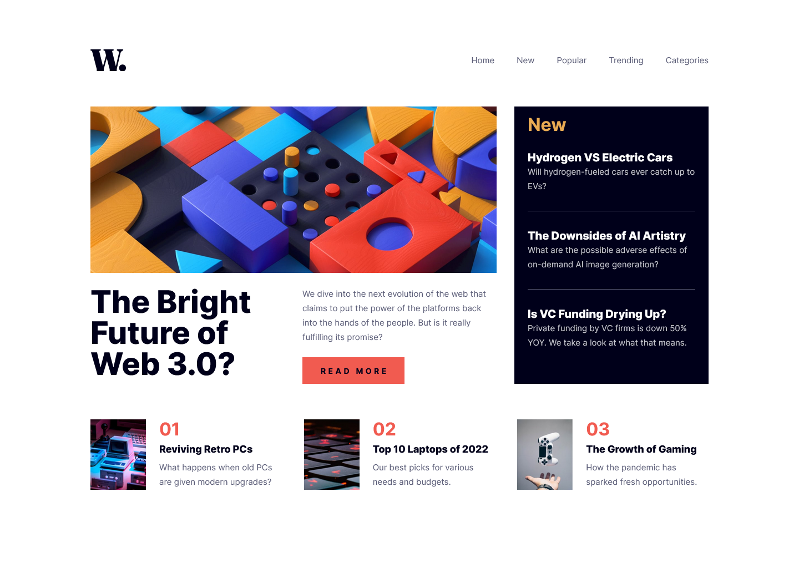

# Frontend Mentor - News homepage solution

This is a solution to the [News homepage challenge on Frontend Mentor](https://www.frontendmentor.io/challenges/news-homepage-H6SWTa1MFl). Frontend Mentor challenges help you improve your coding skills by building realistic projects. 

## Table of contents

- [Overview](#overview)
  - [The challenge](#the-challenge)
  - [Screenshot](#screenshot)
  - [Links](#links)
- [My process](#my-process)
  - [Built with](#built-with)
  - [What I learned](#what-i-learned)
  - [Continued development](#continued-development)
  - [Useful resources](#useful-resources)
- [Author](#author)

## Overview

### The challenge

Users should be able to:

- View the optimal layout for the interface depending on their device's screen size
- See hover and focus states for all interactive elements on the page

### Screenshot



### Links

- [Solution URL](https://github.com/loki-pepe/news-homepage)
- [Live Site URL](https://loki-pepe.github.io/news-homepage/)

## My process

### Built with

- Semantic HTML5 markup
- ARIA attributes
- CSS custom properties
- Flexbox
- CSS Grid
- Mobile-first workflow

### What I learned

I learned about the ARIA practices regarding the overlay navigation menu controlled by a button.

I also learned how to trap focus on an element by creating an object whith two methods:

```
function createFocusTrap(element) {
    const selector = "a[href], button:not([disabled]), textarea, input, select, [tabindex]:not([tabindex='-1'])";

    function trapFocusListener(e) {
        if (e.key !== "Tab") return;

        const focusableElements = element.querySelectorAll(selector)
        if (focusableElements.length === 0) return;

        const first = focusableElements[0];
        const last = focusableElements[focusableElements.length - 1]

        if (e.shiftKey) {
            if (document.activeElement === first) {
                e.preventDefault();
                last.focus();
            }
        } else {
            if (document.activeElement === last) {
                e.preventDefault();
                first.focus();
            }
        }
    }

    return {
        activate() {
            element.addEventListener("keydown", trapFocusListener);
        },
        deactivate() {
            element.removeEventListener("keydown", trapFocusListener);
        },
    };
}
```
The focus is trap is created with `const focusTrap = createFocusTrap(/*target element*/)` and controlled with `focusTrap.activate()` and `focusTrap.deactivate()`.

### Continued development

I plan on furthering my knowledge on ARIA practices.

### Useful resources

- [ARIA Authoring Practices Guide](https://www.w3.org/WAI/ARIA/apg/) - A guide on how to build accessibility semantics into web patterns and widgets.
- [MDN Web Docs](https://developer.mozilla.org/) - An extensive resource for web development.
- [Stack Overflow](https://stackoverflow.com/) - Community answers to specific questions.
- [CSS Clamp Generator](https://css-clamp-generator.com/) - A helpful calculator for using the CSS `clamp()` function.

## Author

- GitHub - [Lovro Peraić](https://github.com/loki-pepe)
- Frontend Mentor - [@loki-pepe](https://www.frontendmentor.io/profile/loki-pepe)
